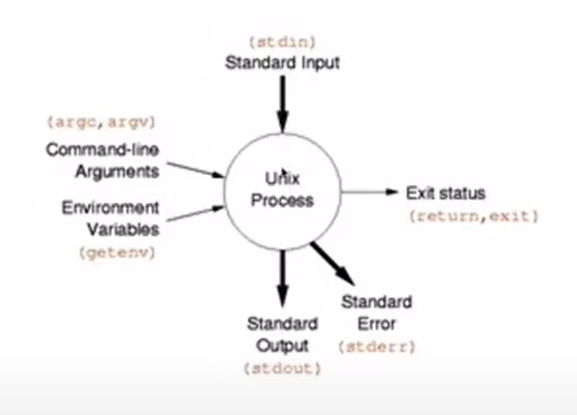

# 리눅스 연습 구름IDE를 이용한 우분투+생활코딩 참고

## 왜 CLI 인가?
1. GUI는 에너지를 많이 먹는다. 따라서 서버컴퓨터나 데이터 관련 컴퓨터는 CLI 사용
2. GUI 방식은 쉽지만 순차적으로 진행되는 일을 자동화 하기는 힘들다. CLI의 강력한 효과는 순차적으로 실행
mkdir why; cd why; 즉 디렉토리를 만들고 들어가는게 아니고 미리 이렇게 지정해놓을 수 있다.
즉 중간과정에 컴퓨터를 지켜보고 있을 필요가 없다.
mkdir이 매우 시간이 오래걸리는 명령이라면... 2번이 아주 효과적
3. 파이프라인
ls --help | grep sort
| 파이프
grep은 필요한거 찾는 명령어
| 파이프를 통해 프로그램과 프로그램을 연결.
ps aux | grep apache

## ls
현재 디렉토리의 파일 목록을 출력하는 명령어. 'ls -l'은 자세히 보기 파일의 리스트를 보자
'ls -a'
-rw-rw-r-- 1 root root    0  4월 14 05:37 empty_file.txt
drwxrwxr-x 2 root root 4096  4월 14 05:36 hello_linux
drw의 d는 디렉토리 라는 뜻
d가 안붙어있으면 파일.

## ls
-a 했을때 숨김파일도 나옴. .이 붙어있으면 숨김파일인거
숨김파일은 ls했을때는 안나옴

## pwd
현재 위치하고 있는 디렉토리를 알려주는 명령어

## mkdir
mkdir 새로 생성할 디렉토리명

mkdir -p dir1/dir2/dir3/dir4 (-p --;sparents)
형식으로도 가능.
touch
touch empty_file.txt

## cd
cd 이동할 디렉토리의 경로명

상대경로와 절대경로
상대경로는 현재 디렉토리의 위치를 기준으로 다른 디렉토리의 위치를 표현하는 것으로 ..은 부모 디렉토리를 의미합니다. 'cd ..'은 현재 디렉토리의 부모 디렉토리로 이동하는 명령이 됩니다. 참고로 현재 디렉토리는 '.' 입니다. 

절대경로는 최상위 디렉토리를 기준으로 경로를 표현하는 것을 의미합니다. 최상위 디렉토리는 루트(root) 디렉토리라고 하고 '/' 입니다. 'cd /'는 최상위 디렉토리로 이동한다는 뜻입니다. 'cd /home/egoing'은 현재 디렉토리가 무엇이건 언제나 '/home/egoing'을 의미하는데 이런 식의 경로 표현을 절대경로라고 합니다. 

## rm
rm 파일명
rm -r 디렉토리명

## --help
명령어 뒤에 --help를 붙이면 명령의 사용설명서가 출력됩니다. 

예 

ls --help
rm --help
mkdir --help
pwd --help

## cp
copy의 약자 cp abc.txt def.txt abc를 def로 이름 바꿔서 복사

cp abc.txt xyz
xyz라는 디렉토리가 없다면 abc.txt 파일을 xyz 파일로 복사합니다.
xyz라는 디렉토리가 있다면 xyz 디렉토리 안에 abc.txt 파일을 복사합니다.

## mv
move의 약자

mv abc.txt def.txt
abc.txt 파일을 def.txt로 이름을 바꾸어 이동합니다.
파일 이름을 바꾸는 것과 결과가 같습니다.

mv abc.txt xyz
xyz라는 디렉토리가 없다면 abc.txt 파일을 xyz로 이름을 바꾸어 이동합니다.
xyz라는 디렉토리가 있다면 xyz 디렉토리 안으로 abc.txt 파일을 이동합니다.\

## sudo

super user의 권한으로 활동할 수 있는 사용자라면 sudo 명령어를 붙여서
임시로 그 명령어만 super 유저의 권한으로 실행
관리자 권한 느낌인듯

## nano vi 편집기
^ -> 컨트롤키

## Package Manager(앱스토어 같은거)
### apt
apts-get update
sudo apt-get update 설치할 수 있는 프로그램의 최신 목록 업데이트

sudo apt-cache search htop
sudo apt-get install htop
htop은 작업관리자같은거 ... graphical 하게 보여줌
sudo apt-get upgrade htop
sudo apt-get remove htop

## 파일 다운로드(wget)
url 을 통해 다운 url을 알아야 함
wget url
wget -O (파일명) (url)

## IO Redirection

### standard output과 error
ls -l > result.txt
cat result.txt

unix Process(mkdir ls-l ps) 모니터로 출력되는 결과(standard output)을 redirection 시켜서 >(redirect기호)로 통해 방향을 바꿔서 저장 가능.
unix process는 standard output과 standard error로 구분 >(1>)는 standard output만 redirection standard error의 redirection은 (2>) 사용해야함.

하이브리드 rm rename2.txt 1> result.txt 2> error.log

### standard input
cat 엔터를 누르고 입력하면 계속 input으로 받아들임
cat종료하고싶으면 control+d
cat < result.txt 는 standard input으로 받은거 
cat hi 는 인자로 받은 것

